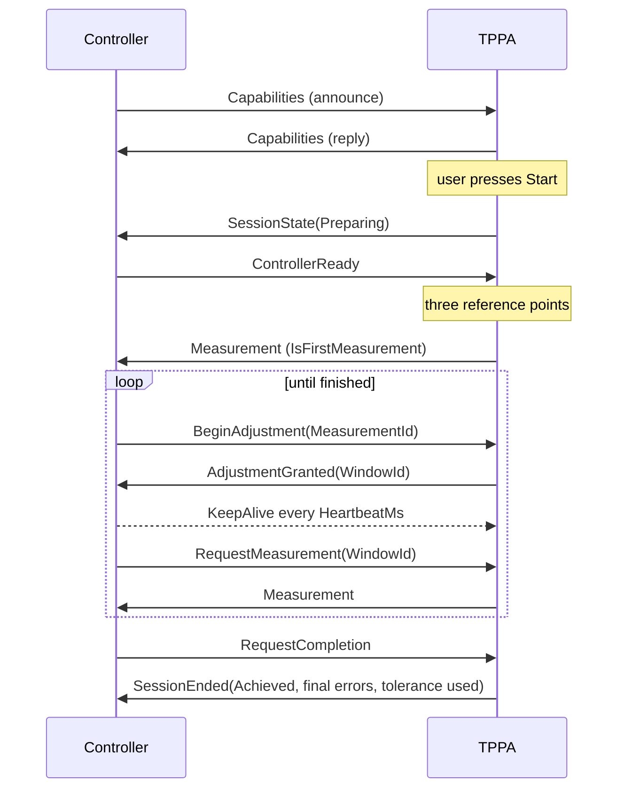

# External correction (three point polar alignment driven by another plugin)

This document is the contract between the Three Point Polar Alignment plugin (TPPA) and an external
controller plugin that moves the mount axes, for example the MLAstro RPA plugin. TPPA keeps measuring,
the external controller keeps adjusting.

The feature is **detected, not enabled**. TPPA keeps its stock behaviour and only hands the session
over to a controller while that controller is announcing itself on the message broker.

## 1. Responsibility split

| | TPPA | External controller |
|---|---|---|
| Three reference points, plate solving, polar error estimation | yes | |
| Session and camera lifecycle, slew, guiding, TPPA UI | yes | |
| Deciding *when* TPPA takes the next exposure | no, only on request | yes |
| Correction strategy (safety factor, axis mode, overshoot, backlash) | | yes |
| Hardware movement | | yes |
| Ending the session | yes, it is the only owner of the session | requests it |

Two different "estimate" mechanisms exist in TPPA and only one of them is involved here:

* `ContinuousPolarErrorEstimator` still runs in external mode. It produces the numbers published in a
  `Measurement`.
* `AutomatedAdjustmentController` is **not** used. TPPA never nudges the axes itself in external mode.

## 2. Topics

Both topics carry an `IMessage` whose `Content` is the JSON of the same envelope, so the two plugins
never need to share a type or an assembly.

| Topic | Published by | Subscribed by |
|---|---|---|
| `PolarAlignmentPlugin_PolarAlignment_ExternalEvent` | TPPA | controller |
| `PolarAlignmentPlugin_PolarAlignment_ExternalCommand` | controller | TPPA |

The pre-existing topics (`..._Progress`, `..._AlignmentError`, `..._PauseAlignment`,
`..._ResumeAlignment`) and their messages are unchanged and keep working in external mode.

## 3. Envelope

Every message carries:

| Field | Meaning |
|---|---|
| `Version` | Interface version. A receiver with a different value ignores the message. |
| `SessionId` | Session the message belongs to. Session scoped messages are ignored by other sessions. |
| `CommandId` | Unique per command. Repeating a `CommandId` is idempotent: TPPA does not act twice. |
| `ReplyTo` | `CommandId` this message answers, when it is a reply. |
| `SequenceNumber` | Monotonic per sender, for diagnostics. |
| `Kind` | Message kind, see below. |
| `IntendedRecipient` | `TPPA` or `MLAstroRPA`. |
| `Payload` | Kind specific JSON object. |

## 4. Kinds

| Kind | Direction | Purpose |
|---|---|---|
| `Capabilities` (announce) | controller → TPPA | The controller announces itself. TPPA answers even when no session is running. |
| `Capabilities` (reply) | TPPA → controller | Interface version, TPPA version, supported kinds, tolerance, heartbeat / silence timeout / ready timeout / session timeout / grace / stop ack timeout, calculation mode, current session. |
| `SessionState` | TPPA → controller | Heartbeat and state change: `Preparing`, `Measuring`, `WaitingForRequest`, `WindowOpen`, `Verifying`, `Ended`, plus a reason. |
| `ControllerReady` | controller → TPPA | Hardware connected and axes stationary; TPPA may start the reference sweep. |
| `Measurement` | TPPA → controller | One polar error sample, see the field list below. |
| `BeginAdjustment` | controller → TPPA | "I want to hold the capture while I move." |
| `AdjustmentGranted` | TPPA → controller | Capture window granted, with `WindowId`, `MaxWindowMs`, `SilenceTimeoutMs`. |
| `RequestMeasurement` | controller → TPPA | Close the window and take a new exposure now. Valid with and without a window. |
| `RequestCompletion` | controller → TPPA | "I believe we are done" - TPPA verifies with its own policy. |
| `KeepAlive` | controller → TPPA | Refreshes the silence watchdog while a window is held. |
| `PauseRequested` | TPPA → controller | The operator paused or resumed the run. While paused the controller must not start a move and has to stop a move in progress, because TPPA stops capturing. |
| `StopRequested` | TPPA → controller | Stop and park, with a reason and an ack timeout. |
| `Stopped` | controller → TPPA | Acknowledgement, with a hardware stop status (`ok`, `unknown`, `fault`). |
| `Cancel` | controller → TPPA | The controller gives up on the session, with a reason: `UserStop` (stop pressed on the controller), `BrokerDisabled` (the broker was switched off in the plugin options), `Disconnect`, `FirmwareDisconnected` (serial or wireless firmware link lost), `SessionTimeout`, `ExternalLost`, `ControllerFault`. TPPA logs the reason and shows it in a toast. |
| `Fault` | controller → TPPA | The controller cannot continue (hardware, link, repeated unusable measurements). TPPA treats it as a cancel carrying the same reason and detail. |
| `SessionEnded` | TPPA → controller | Last message of a session: reason, achieved, final errors, tolerance used, samples used. |

### 4.1 `Measurement` fields

Only arcminutes are published: that is the unit TPPA itself works in, so the controller never
converts and never rounds differently from TPPA.

| Field | Notes |
|---|---|
| `MeasurementId`, `SessionId`, `WindowId`, `SampleIndex`, `IsFirstMeasurement`, `TimestampUtc` | bookkeeping |
| `Status` | `Valid`, `Unstable` (continuous estimate unstable) or `CaptureFailed` |
| `AzimuthErrorArcMin`, `AltitudeErrorArcMin`, `TotalErrorArcMin` | signed polar error in arcminutes, exactly the values TPPA shows in its own UI |
| `ToleranceArcMin` | tolerance TPPA is using |
| `ToleranceReached` | this single sample is at or below tolerance |
| `AutoFinishConditionMet` | TPPA's own finish condition (consecutive samples below tolerance) is met |
| `ConsecutiveBelowTolerance` | how many consecutive samples were below tolerance |
| `Northern` | hemisphere, needed to turn the signed errors into up/down moves |
| `ContinuousEstimation` | which calculation path produced the numbers |

The controller derives the correction direction itself, from the sign of the error and `Northern`:
a positive azimuth error means "move left" (negative "move right"), and a positive altitude error
means "move down" in the northern hemisphere and "up" in the southern one. These two rules are the
only place where TPPA's own display convention has to be reproduced outside TPPA.

## 5. Flow

## 6. Safety rules

1. **The capture window TTL is a silence timeout, not a total duration.** TPPA is not allowed to
   capture while the controller is moving, and a move chain can take minutes, so the watchdog only
   measures how long the controller has been quiet. The controller must therefore send a `KeepAlive`
   from an independent timer, never from the thread that is blocked inside a move.
2. **TPPA never ends a session because of the measured error in external mode.** Reaching the
   tolerance only sets `ToleranceReached` / `AutoFinishConditionMet`; the controller decides to call
   `RequestCompletion`, and TPPA verifies before ending.
3. **Closing a window is not ending a session.** When the controller goes silent, TPPA closes the
   window, publishes `SessionState(SilenceTimeout)` and keeps the session open. Only after the grace
   period does it end the session as `ExternalLost`.
4. **A session time limit always applies.** It counts only the time the controller is *not* holding a
   window, so a long move chain cannot trip it. On expiry TPPA sends `StopRequested(SessionTimeout)`
   and expects a `Stopped` acknowledgement within the ack timeout.
5. **No unbounded waits.** `ControllerReady`, `BeginAdjustment` replies and stop acknowledgements all
   have timeouts; an expiry produces a `SessionEnded` with a reason.
6. **No periodic self-triggered capture.** TPPA captures only when asked to. An automatic poll would
   risk capturing while the motors are running.

## 7. No settings on the TPPA side

TPPA has nothing to configure. The mode is **detected**, not enabled:

* A controller announces itself on the command topic every few seconds while it is connected and wants
to own the session.
* TPPA treats a controller as present while those announcements keep arriving (15 s window) and falls
back to its normal behaviour as soon as they stop.

The protocol values are fixed constants in the plugin. They are published in the `Capabilities` reply
so the controller never has to hard code them:

| Value | Fixed value |
|---|---|
| Heartbeat: `SessionState` interval, and the interval the controller has to keep alive in | 2000 ms |
| Controller silence allowed while a capture window is open | 15000 ms |
| How long TPPA waits for `ControllerReady` | 30000 ms |
| Grace before a silent controller is treated as gone | 10000 ms |
| Session safety limit, counting only the time outside capture windows | 1800 s |
| Stop acknowledgement timeout | 5000 ms |

`AlignmentTolerance` still has to be greater than zero: TPPA cannot judge "good enough" without it. If a
controller is connected and the tolerance is zero, TPPA warns and runs its normal correction loop.

### 7.1 When a controller disappears

| Moment | Behaviour |
|---|---|
| Before the run, no announcements | The stock code path runs, unchanged. |
| Start: controller present, but it never reports ready | TPPA warns and runs its normal correction loop. It does not abort the run. |
| Start: controller present, but the alignment tolerance is zero | TPPA warns and runs its normal correction loop. |
| Mid-session: announcements stop | TPPA closes the external session with `SessionEnded(ExternalLost)`, warns, and continues the run with its normal correction loop. It does not touch the motors, because the controller that owns them is gone. |

## 8. Required controller setup

1. Stay connected: keep announcing for as long as you want to own the session, and stop announcing (or
disconnect) to hand control back to TPPA. An announce interval well below the 15 s presence window is
required; 5 s is a good value.
2. Leave the alignment system on `None` and `Do automated adjustments` off; TPPA must not move
anything by itself.
3. Keep `AutoPause` off, otherwise every update pauses the loop.
4. Publish `ControllerReady` only when the axes really are stationary, and answer `StopRequested`
within the announced ack timeout.
5. Read every tunable value from the `Capabilities` reply instead of hard coding it.

## 9. Tests

`NINA.Plugins.PolarAlignment.Test/ExternalCorrectionProtocolTest.cs` covers the protocol without a
camera or mount: window grant and reuse, idempotent `BeginAdjustment` / `RequestMeasurement`, window
expiry on silence, `ExternalLost` after the grace period, keep-alive keeping a long move window open,
completion and cancel while a window is open, stop acknowledgement and the stop-ack timeout, the
session time limit, session scoping, interface version mismatch, cancellation, the direction mapping
for both hemispheres and the JSON round trip.

There is no simulator in the plugin: the reference controller is the MLAstro RPA plugin
(`TppaBrokerClient` plus `ExternalCorrectionRunner` in that repository).
